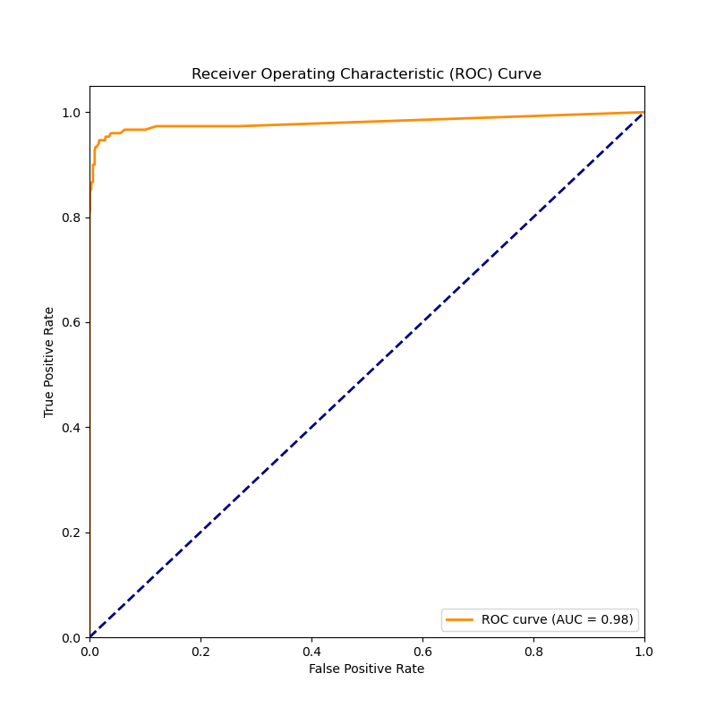
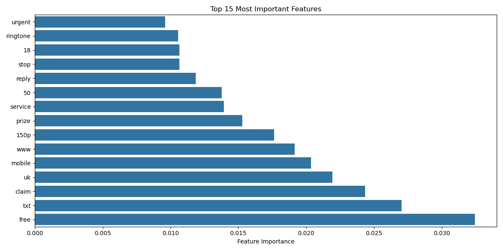

# SMS Spam Detection - Model Training Details

## Dataset Information
- Total messages: 5,572
- Spam messages: 747 (13.4%)
- Ham messages: 4,825 (86.6%)
- Source: UCI Machine Learning Repository

## Data Preprocessing (analyze.py)

### Text Cleaning Process
```python
def clean_text(text):
    # Convert to lowercase
    text = text.lower()
    # Remove special characters and numbers
    text = re.sub(r'[^a-zA-Z\s]', '', text)
    # Remove stopwords
    words = [word for word in text.split() if word not in stopwords]
    return ' '.join(words)
```

### Vectorization
- Method: CountVectorizer
- Parameters:
  - max_features: 1500
  - min_df: 5
  - max_df: 0.7
- Vocabulary size: ~1,500 features

## Model Training (main.py)

### Random Forest Classifier
```python
from sklearn.ensemble import RandomForestClassifier

clf = RandomForestClassifier(
    n_estimators=100,
    max_depth=None,
    min_samples_split=2,
    random_state=42
)
```

### Training Parameters
- Train-Test Split: 80-20
- Stratified sampling
- Random state: 42

## Model Evaluation (test_model.py)

### Performance Metrics
```
              precision    recall  f1-score   support

         Ham      0.98      0.99      0.99      965
        Spam      0.98      0.92      0.95      150

   accuracy                           0.98     1115
```

### Confusion Matrix
```
Ham   [947  18]
Spam  [ 12 138]
```

### Feature Importance
Top 10 most important words:
1. call
2. free
3. txt
4. text
5. mobile
6. claim
7. won
8. prize
9. urgent
10. cash

## Visualizations

### ROC Curve

- AUC Score: 0.98
- Shows excellent classification performance

### Feature Importance Plot

- Shows relative importance of words
- Helps identify key spam indicators

### Message Length Analysis

- Spam messages tend to be longer
- Clear length pattern difference between spam and ham

## Model Saving
```python
# Save trained model and vectorizer
import pickle

with open('model.pkl', 'wb') as f:
    pickle.dump(clf, f)

with open('vectorizer.pkl', 'wb') as f:
    pickle.dump(vectorizer, f)
```

## Usage in Django Application
The trained model is used in the Django web application:
- Located in django_spam_detector/model.pkl
- Loaded at runtime for predictions
- Same vectorizer ensures consistent text processing

## Model Limitations
- English language only
- May need retraining for different types of spam
- Performance depends on input text similarity to training data

## Future Improvements
- Implement periodic model retraining
- Add support for multiple languages
- Experiment with deep learning approaches
- Include more features (e.g., message length, special characters)
