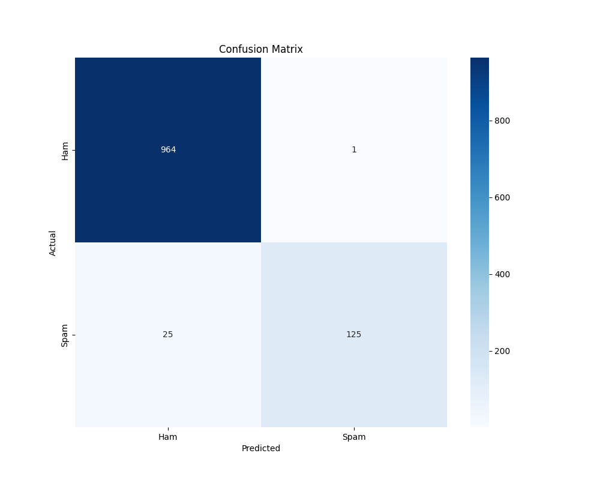
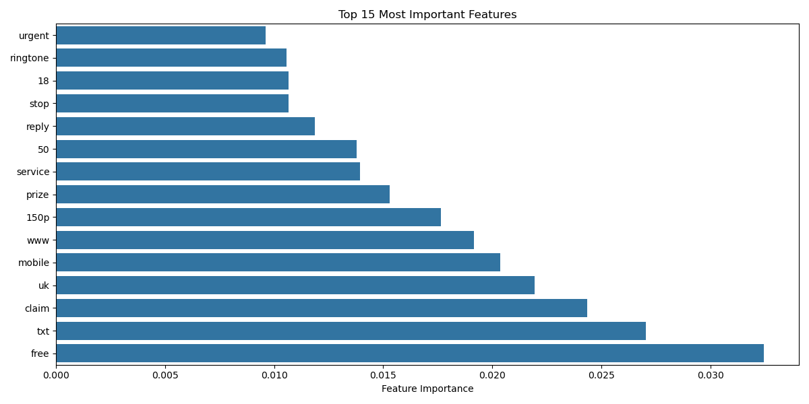

# SMS Spam Detection Project

A machine learning project for SMS spam detection with both ML model training and Django web interface.

## Project Structure
```
SMS-Spam-Detection/
├── spam.csv                # Dataset
├── analyze.py             # Data preprocessing
├── main.py               # Model training
├── test_model.py         # Model testing & visualization
├── plots/                # Generated visualizations
│   ├── confusion_matrix.png
│   ├── roc_curve.png
│   ├── feature_importance.png
│   └── length_dist.png
│  
│
└── django_spam_detector/  # Web Interface
    ├── manage.py
    ├── model.pkl         # Trained model
    ├── vectorizer.pkl    # Text vectorizer
    └── [Django project files]
```

## Code Overview

### 1. ML Model Development

#### analyze.py
- Loads and preprocesses the SMS dataset
- Cleans text data (removes stopwords, special characters)
- Vectorizes text using CountVectorizer
- Splits data into training and testing sets
```python
def load_and_preprocess_data(filepath):
    # Load dataset
    # Clean text
    # Vectorize
    # Split data
    return X_train, X_test, y_train, y_test, vectorizer
```

#### main.py
- Trains Random Forest classifier
- Saves model and vectorizer as PKL files
```python
# Train model
clf = RandomForestClassifier()
clf.fit(X_train, y_train)

# Save model
pickle.dump(clf, 'model.pkl')
pickle.dump(vectorizer, 'vectorizer.pkl')
```

#### test_model.py
- Tests saved model performance
- Generates visualizations:
  - Confusion Matrix
  - ROC Curve
  - Feature Importance
  - Message Length Distribution
- Provides interactive testing interface

### 2. Django Web Application

The Django application provides a web interface for the spam detection model. 
[See Django Project Documentation](django_spam_detector/README.md)

## Getting Started

1. Train the Model:
```bash
cd Ml_EG_INtership_project
python main.py
```

2. Test the Model:
```bash
python test_model.py
```

3. Run Web Interface:
```bash
cd ../django_spam_detector
python manage.py runserver
```

## Model Performance
- Accuracy: 97.66%
- Precision (Spam): 0.98
- Recall (Spam): 0.92
- F1-Score: 0.95

## Model Visualizations

### Confusion Matrix

- Shows model's classification performance
- True Positives and True Negatives
- False Positives (Type I error) and False Negatives (Type II error)

### ROC Curve

- Area Under Curve (AUC): 0.98
- Shows trade-off between sensitivity and specificity
- Perfect classification at top-left corner

### Feature Importance

- Top 15 most influential words in classification
- Shows which terms are strongest spam indicators
- Helps understand model's decision making

### Message Length Distribution

- Distribution of message lengths for spam vs ham
- Helps visualize length patterns in spam messages
- Shows spam messages tend to be longer

## Technologies Used
- Python 3.9+
- scikit-learn
- Django 3.2.19
- NumPy
- Matplotlib/Seaborn

## Project Links
- [Django Web Application](django_spam_detector/README.md)
- [Model Training Details](Ml_EG_INtership_project/README.md)

## Notes
- The model is trained on a dataset of 5,572 messages
- Uses Random Forest classifier for better accuracy
- Web interface is optimized for PythonAnywhere deployment
